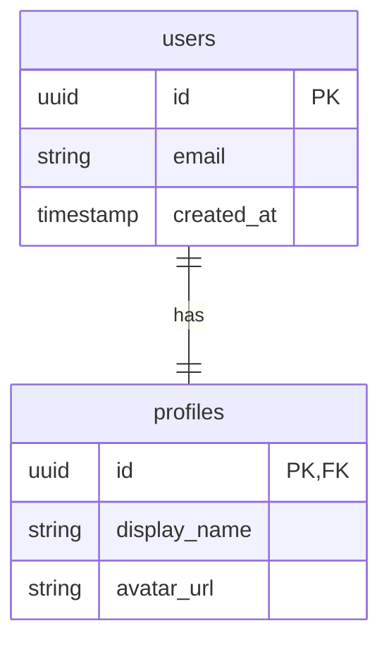

# Database Schema & RLS Policies

## Standards
- **Primary Key**: `UUID` (gen_random_uuid())
- **Timestamps**: `created_at` (now()), `updated_at` (now())
- **Naming**: `snake_case` for tables and columns.
- **Security**: RLS strictly enabled.

## Core Tables

### `profiles`
Stores user profile information, linked to `auth.users`.

- `id`: UUID (FK -> auth.users.id)
- `email`: Text
- `display_name`: Text
- `avatar_url`: Text
- `created_at`: Timestamptz
- `updated_at`: Timestamptz

#### RLS Policies
- **SELECT**: Users can view their own profile. `auth.uid() = id`.
- **UPDATE**: Users can update their own profile. `auth.uid() = id`.
- **INSERT**: Handled via Trigger on `auth.users` creation (recommended) or allow authenticated insert if matching ID.



## Setup Scripts

### Enable Auto-Update Timestamp
```sql
create extension if not exists moddatetime schema extensions;
```

### Profiles Table
```sql
create table public.profiles (
  id uuid not null references auth.users on delete cascade,
  email text,
  display_name text,
  avatar_url text,
  created_at timestamptz not null default now(),
  updated_at timestamptz not null default now(),
  primary key (id)
);

alter table public.profiles enable row level security;

create policy "Users can view own profile"
on public.profiles for select
to authenticated
using ( auth.uid() = id );

create policy "Users can update own profile"
on public.profiles for update
to authenticated
using ( auth.uid() = id );

-- Trigger for auto update updated_at
create trigger handle_updated_at before update on public.profiles
  for each row execute procedure moddatetime (updated_at);
```
