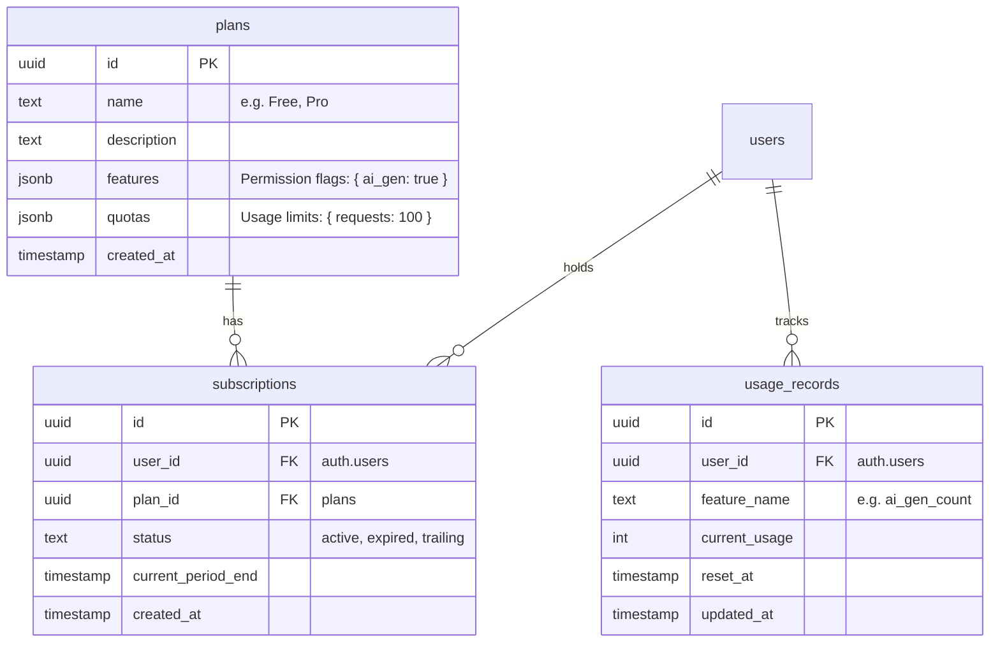

# Subscription and Quota System Design

## Overview
This system provides a framework for managing user subscription plans, feature permissions, and usage quotas.

## Data Model

## Business Logic
1. **Authorization**: Check `plans.features` for permission flags.
2. **Quota Check**: Compare `usage_records.current_usage` with `plans.quotas`.
3. **Usage Tracking**: Increment `usage_records` after successful feature operation.

## Security (RLS)
- `plans`: Readable by all users.
- `subscriptions`: Users can only read their own subscription.
- `usage_records`: Users can read their own usage, but modifications are handled by Server Actions (Admin privilege where necessary).
